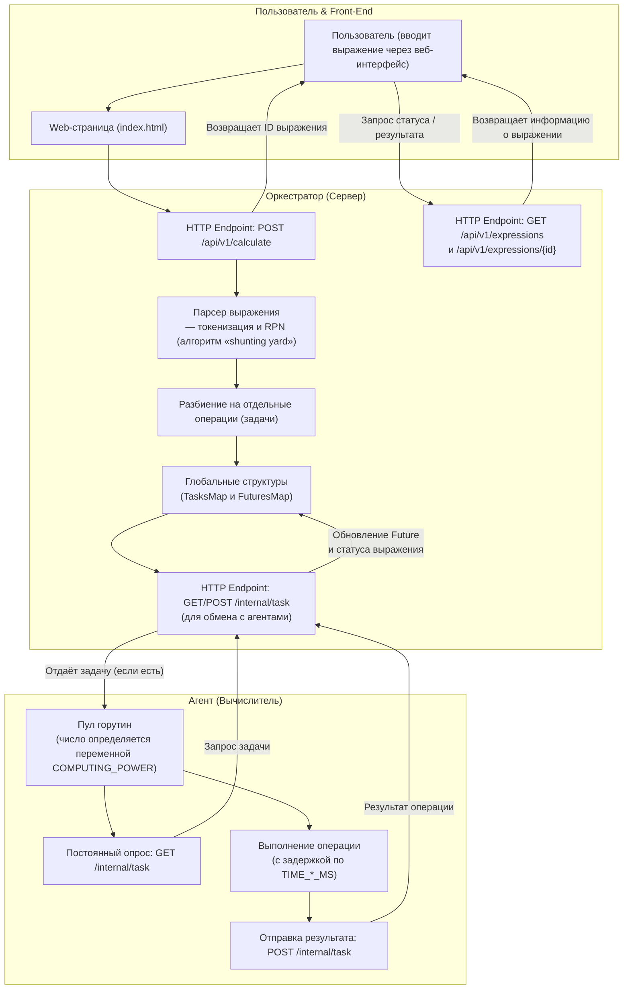

# Распределённый вычислитель арифметических выражений

Этот проект представляет собой распределённую систему для вычисления арифметических выражений. Он принимает выражения через REST API, вычисляет их асинхронно (с использованием распределённого агента) и позволяет получать информацию о статусе и результате вычислений. Помимо API, проект включает простой веб-интерфейс для взаимодействия с системой.

## Особенности

- **Асимметричная архитектура:** Разделение на API-сервер и распределённого агента для выполнения вычислений.
- **Поддержка основных операций:** Сложение, вычитание, умножение, деление (с обработкой ошибок, например, деления на ноль).
- **Асинхронные вычисления:** После отправки запроса вычисление происходит в фоновом режиме.
- **REST API:** Эндпоинты для подачи выражения, получения списка всех вычислений и запроса статуса конкретного выражения.
- **Простой веб-интерфейс:** HTML-страница для ввода выражения и просмотра результатов.
- **Настраиваемость:** Параметры, такие как порт, уровень логирования, время выполнения операций и вычислительная мощность, задаются через файл `.env`.

## Быстрый старт

### Необходимые компоненты

- [Go](https://golang.org/) (версия 1.24+)

### Запуск проекта с использованием cmd.exe

1. Убедитесь, что у вас установлен Go (версии 1.24 или выше).
2. Клонируйте репозиторий:
```bash
git clone https://github.com/
cd calculator
```
3. Установите зависимости:
```bash
go mod tidy
```
4. Запустите сервисы командой:
```bash
start go run cmd/orchestrator/main.go
start go run cmd/agent/main.go
```
5. По умолчанию сервис будет доступен на `http://localhost:8080`.

### Запуск проекта с другими терминалами

Шаги 1-3 аналогичные.

4. Запустите оркестратор командой:
```bash
go run cmd/orchestrator/main.go
```
5. Откройте новое окно терминала и перейдите в директорию проекта:
```bash
cd calculator
```
6. Запустите агент командой:
```bash
go run cmd/agent/main.go
```
7. По умолчанию сервис будет доступен на `http://localhost:8080`.
## Документация API

### 1. Вычисление выражения

**Эндпоинт:** `/api/v1/calculate`  
**Метод:** `POST`  
**Описание:** Принимает JSON с арифметическим выражением для вычисления.

**Тело запроса:**

```json
{
  "expression": "2+2*2"
}
```

**Успешный ответ:**
- **Статус:** `201 Created`
- **Тело ответа:**

```json
{
  "id": "a1b2c3d4-e5f6-7890-abcd-ef1234567890"
}
```

**Примеры ошибок:**
- **Неподдерживаемый метод (например, GET вместо POST):**

  ```json
  {
    "error": "only POST method is allowed"
  }
  ```

- **Неверный формат JSON:**

  ```json
  {
    "error": "invalid JSON"
  }
  ```

- **Пустое выражение:**

  ```json
  {
    "error": "no expression provided"
  }
  ```

### 2. Получение списка всех вычислений

**Эндпоинт:** `/api/v1/expressions`  
**Метод:** `GET`  
**Описание:** Возвращает список всех отправленных выражений с их статусом и результатом.

**Пример ответа:**
- **Статус:** `200 OK`
- **Тело ответа:**

```json
{
  "expressions": [
    {
      "id": "a1b2c3d4-e5f6-7890-abcd-ef1234567890",
      "status": "completed",
      "result": 6
    },
    {
      "id": "z9y8x7w6-v5u4-3210-tsrq-ponmlkjihgfe",
      "status": "pending",
      "result": 0
    }
  ]
}
```

### 3. Получение результата по ID

**Эндпоинт:** `/api/v1/expressions/{id}`  
**Метод:** `GET`  
**Описание:** Возвращает статус и результат вычисления для выражения с указанным ID.

**Пример успешного ответа:**
- **Статус:** `200 OK`
- **Тело ответа:**

```json
{
  "id": "a1b2c3d4-e5f6-7890-abcd-ef1234567890",
  "status": "completed",
  "result": 6
}
```

**Примеры ошибок:**
- Если ID не передан в URL:

  ```json
  {
    "error": "ID not provided"
  }
  ```

- Если выражение с данным ID отсутствует:

  ```json
  {
    "error": "there is no such expression"
  }
  ```

## Примеры использования cURL

### Успешный запрос на вычисление

```bash
curl --location "http://localhost:8080/api/v1/calculate" --header "Content-Type: application/json" --data "{\"expression\": \"2+2*2\"}"
```

_Ожидаемый ответ:_

```json
{
  "id": "a1b2c3d4-e5f6-7890-abcd-ef1234567890"
}
```

### Ошибка: Неправильный HTTP-метод

```bash
curl --location "http://localhost:8080/api/v1/calculate" --request GET
```

_Ожидаемый ответ:_

```json
{
  "error": "only POST method is allowed"
}
```

### Ошибка: Пустое выражение

```bash
curl --location "http://localhost:8080/api/v1/calculate" --header "Content-Type: application/json" --data "{\"expression\": \"\"}"
```

_Ожидаемый ответ:_

```json
{
  "error": "no expression provided"
}
```

### Ошибка: Неверный формат JSON

```bash
curl --location "http://localhost:8080/api/v1/calculate" --header "Content-Type: application/json" --data "{invalid json}"
```

_Ожидаемый ответ:_

```json
{
  "error": "invalid JSON"
}
```

## Как это работает

Ниже представлена подробная схема, которая показывает, как всё устроено в системе распределённого вычислителя арифметических выражений.



### Пояснение к схеме

1. **Пользователь и Front-End**
  - Пользователь вводит арифметическое выражение через веб-интерфейс (страница `index.html`).
  - При отправке выражения через HTTP POST запрос к эндпоинту `/api/v1/calculate` пользователь получает уникальный идентификатор (ID) вычисления.

2. **Оркестратор (Сервер)**
  - При получении запроса сервер начинает обработку:
    - **Парсинг**: выражение токенизируется, затем с помощью алгоритма «shunting yard» преобразуется в обратную польскую запись (RPN).
    - **Разбиение на задачи**: каждая операция (сложение, вычитание, умножение, деление) оформляется в виде отдельной задачи с заданным временем выполнения (на основе переменных среды TIME_*_MS).
    - Задачи и соответствующие объекты «future» сохраняются в глобальных мэпах (TasksMap и FuturesMap).
  - Для обмена с агентами используется специальный эндпоинт `/internal/task`:
    - Агент через GET запросы получает задачу.
    - Результат вычисления отправляется обратно через POST запрос, после чего оркестратор обновляет соответствующую Future и статус выражения.
  - Для получения статуса и результата пользователем доступны эндпоинты `/api/v1/expressions` и `/api/v1/expressions/{id}`.

3. **Агент (Вычислитель)**
  - Агент запускается как демон, который создаёт пул горутин (параллельных вычислителей) – число которых определяется переменной COMPUTING_POWER.
  - Каждая горутина постоянно опрашивает оркестратор через GET запрос к `/internal/task` для получения очередной задачи.
  - Получив задачу, агент выполняет соответствующую арифметическую операцию с задержкой (имитируется длительность вычисления) и отправляет результат обратно на сервер через POST запрос.

4. **Результат**
  - После получения результатов всех операций оркестратор собирает их, обновляет статус выражения на «completed» и сохраняет итоговый результат.
  - Пользователь может в любой момент получить обновлённую информацию о статусе и результате вычисления, сделав запрос к соответствующему эндпоинту.

Эта схема иллюстрирует распределённый характер системы: сервер (оркестратор) занимается разбиением выражения на мелкие задачи и управлением их выполнением, а агенты (вычислители) – параллельным выполнением операций с имитацией «тяжёлых» вычислений. Такой подход позволяет масштабировать вычисления, добавляя новые вычислительные узлы (агентов) по мере необходимости.

## Конфигурация

Основные параметры системы задаются через файл `.env`:

```
PORT=8080
LOG_LEVEL=DEBUG
TIME_ADDITION_MS=1000
TIME_SUBTRACTION_MS=1000
TIME_MULTIPLICATIONS_MS=1000
TIME_DIVISIONS_MS=1000
COMPUTING_POWER=10
```

- **PORT:** Порт, на котором слушает сервер.
- **LOG_LEVEL:** Уровень логирования (DEBUG, INFO, WARN, ERROR).
- **TIME_*_MS:** Симулированное время выполнения для каждой арифметической операции.
- **COMPUTING_POWER:** Количество задач, которые может обрабатывать агент параллельно.

## Тестирование

Чтобы запустить тесты проекта, выполните команду:

```bash
go test ./...
```

Команда запустит все модульные тесты, проверяя корректность работы API, вычислительного модуля и логирования.

---

